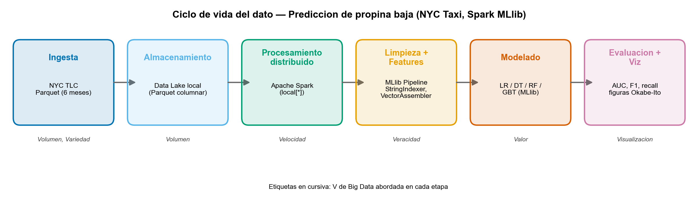

# Predicción de propina baja en taxis de NYC con Apache Spark MLlib

Proyecto final del curso de **Big Data** — Maestría en Inteligencia Artificial,
Escuela de Posgrado de la **Universidad Nacional de Ingeniería (UNI)**.
Docente: Mg. Rosa Virginia Encinas Quille.

Comparación de **cuatro algoritmos de Machine Learning distribuido** (Spark MLlib)
para predecir, sobre **~15 millones de viajes** de taxi de Nueva York y bajo un
**fuerte desbalance de clases (≈9.7:1)**, si un viaje pagado con tarjeta dejará una
**propina baja**. Incluye análisis de **escalabilidad** del procesamiento
distribuido.

> **Modalidad:** Artículo científico. Entregables: artículo IEEE (PDF), presentación
> (15 min) y código reproducible.

---

## Pregunta de investigación

> ¿Qué clasificador distribuido de Spark MLlib ofrece el mejor compromiso entre
> **desempeño predictivo** (robusto al desbalance) y **costo computacional** para
> predecir la propina baja, y **cómo escala** el cómputo con el volumen y los
> núcleos?

## Resultados principales

Comparación sobre 2 M de viajes (80/20), los **cuatro modelos con ponderación de
clases**:

| Modelo | AUC | F1 | Acc. | Recall⁺ (minoría) | Tiempo |
|---|---|---|---|---|---|
| Regresión logística | 0.656 | **0.753** | 0.691 | 0.501 | 9.0 s |
| Árbol de decisión | 0.541 | 0.690 | 0.609 | **0.637** | **3.1 s** |
| Random forest | 0.680 | 0.720 | 0.646 | 0.598 | 27.6 s |
| **GBT** | **0.686** | 0.702 | 0.623 | **0.637** | 49.2 s |

**Hallazgos:**
- **La *accuracy* engaña bajo desbalance.** Un clasificador trivial lograría
  **90.6 %** de exactitud con **0 %** de recall útil. Solo al mirar AUC y recall de
  la minoría (y aplicar ponderación) los modelos resultan útiles.
- **No hay un único ganador:** el **GBT** maximiza el desempeño (mayor AUC y
  recall) al mayor costo; el **random forest** ofrece un AUC casi idéntico a la
  mitad del tiempo; la **regresión logística** es la más eficiente.
- **Escalabilidad:** 20× datos → solo **5×** tiempo (sublineal); **speedup de
  4.7×** con 8 núcleos (consistente con la ley de Amdahl).

## Arquitectura (ciclo de vida del dato)

```
Ingesta (NYC TLC Parquet) → Almacenamiento (Data Lake) → Procesamiento distribuido (Spark)
   → Limpieza + Features (MLlib Pipeline) → Modelado (LR/DT/RF/GBT) → Evaluación + Visualización
```



---

## Estructura del repositorio

```
big-data-nyc-taxi-mllib/
├── src/nyc_taxi_mllib/      # Paquete: ingest, features, models, evaluate, scaling
├── notebooks/               # EDA y experimentos (.ipynb)
├── scripts/                 # download_data, run_experiments, run_strong_scaling, EDA, figuras, slides
├── tests/                   # Smoke tests (pytest)
├── docs/adr/                # Architecture Decision Records (decisiones de diseño)
├── figures/                 # Figuras publication-ready (Okabe-Ito)
├── output/                  # results.json, scaling.json, eda.json
├── paper/                   # Artículo IEEE (LaTeX) + PDF compilado
├── slides/                  # Presentación (.pptx / .pdf)
└── data/raw/                # Datos (ignorados por git; se descargan)
```

## Reproducción

Requisitos: Python 3.10–3.12, Java 11+ (para Spark).

```bash
# 1. Entorno
python -m venv .venv && source .venv/bin/activate
pip install -r requirements.txt          # o: pip install -e .

# 2. Datos (6 meses de 2023, ~20M de viajes; ~300 MB)
python scripts/download_data.py --year 2023 --months 1 2 3 4 5 6

# 3. Experimentos (comparación de modelos + escalabilidad de datos)
python scripts/run_experiments.py --train-rows 2000000

# 4. Escalabilidad fuerte (1/2/4/8 núcleos)
python scripts/run_strong_scaling.py --rows 3000000 --cores 1 2 4 8

# 5. Figuras y presentación
python scripts/run_eda.py
python scripts/make_result_figures.py
python scripts/make_architecture.py
python scripts/make_slides.py

# 6. Tests
pytest -q

# 7. Artículo (PDF)
cd paper && pdflatex main && bibtex main && pdflatex main && pdflatex main
```

## Decisiones de diseño (ADR)

Las decisiones clave están documentadas en [`docs/adr/`](docs/adr/): PySpark local
vs. nube, elección del dataset, definición del objetivo (propina baja), algoritmos
comparados, manejo del desbalance y diseño de los experimentos de escalabilidad.

## Datos

NYC TLC Trip Record Data (Yellow Taxi), de dominio público:
<https://www.nyc.gov/site/tlc/about/tlc-trip-record-data.page>. Formato Apache
Parquet. La propina solo se registra en pagos con tarjeta, por lo que el análisis
se restringe a `payment_type == 1` (decisión de veracidad).

## Licencia

MIT — ver [LICENSE](LICENSE).

## Autor

Niels Pacheco — Maestría en Inteligencia Artificial, EPG-UNI. Proyecto final individual.
